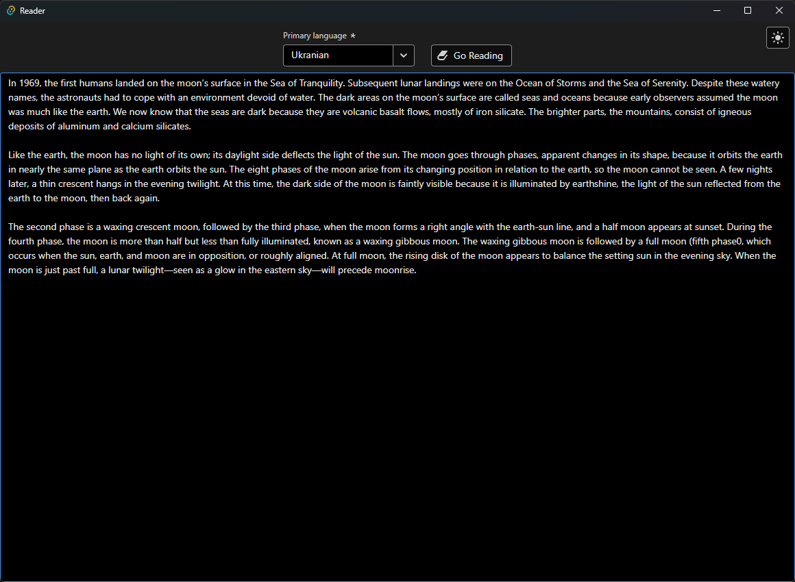
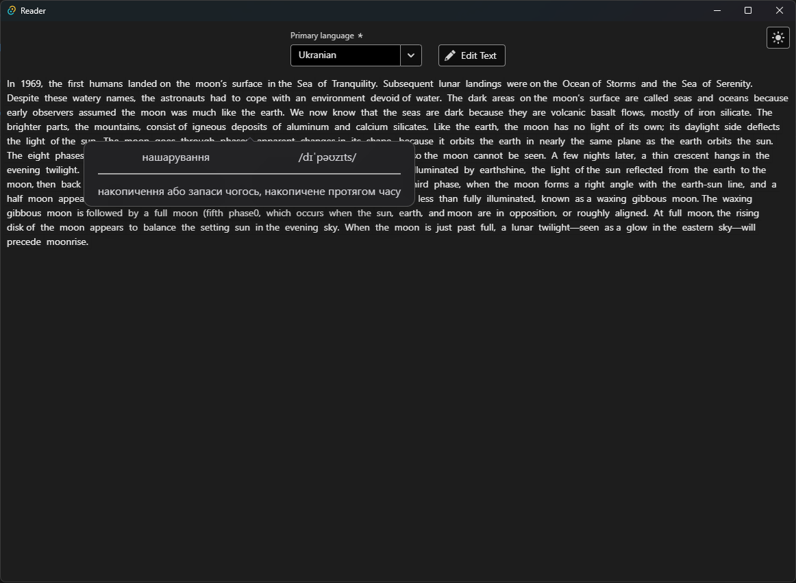
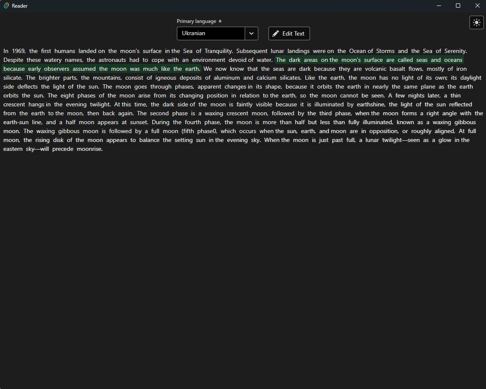
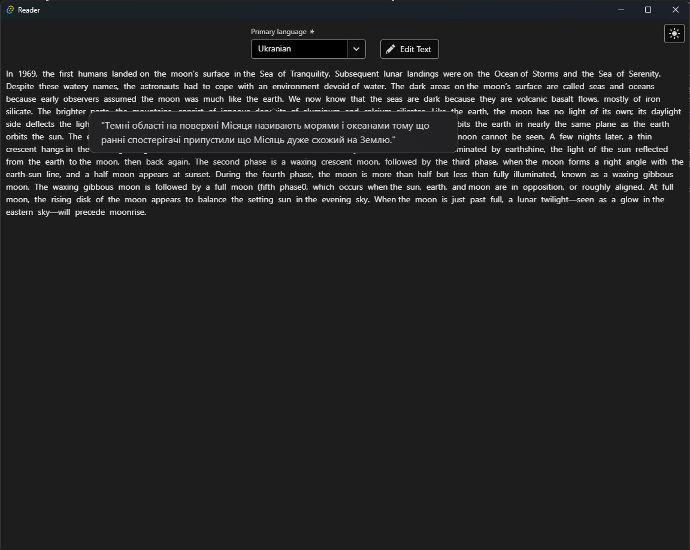

# Reader (code name: XP-Reader)

The project are my efforts to make use of (LLMs) like: ollama-3.1, mistral-nemo, gemma-2

The key goal of this application is to get all you need to read a text on foreign language. There are two main features:

- Get voca nest for word/phrase.
- Get translation for part of sentence(s)/passage.

Fully free to use with pre-installed ollama model!

# How does it work?

1. Select the target language from the dropdown.
2. Paste or input the source text into editor below.

3. Hit "Go reading" button.

- Click on the word you'd like to translate.

- To translate a sentence or segment of text just press and hover your needs.

# Tech stack

_Back-end_: Rust (tauri, serde_json, ollama-rs, tokio, lazy_static)

_Front-end_: ReactJS (Adobe-spectrum, Adobe-aria, Tailwind)
